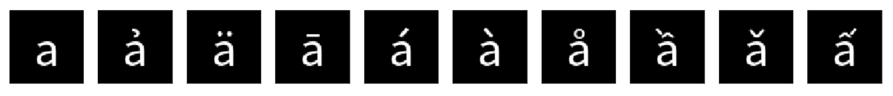

# Glyph-aware Character Embedding



## Setting
After cloning this repository, just run following command to extract word2vec vectors.

```
$ tar jxvf convolutional_AE_300.tar.bz2
```

## Usage

Input:
```py
from gensim.models import KeyedVectors

model = KeyedVectors.load_word2vec_format("../data/convolutional_AE_300.bin", binary=True)
model.most_similar("a")
```

Output:
```
[('а', 1.0000001192092896),
 ('ả', 0.961397111415863),
 ('ä', 0.9610118269920349),
 ('ā', 0.9582812190055847),
 ('á', 0.957198441028595),
 ('à', 0.9558833241462708),
 ('å', 0.938391923904419),
 ('ầ', 0.9370290040969849),
 ('ǎ', 0.9368112087249756),
 ('ấ', 0.9365179538726807)]
```

## Ref.

- [\[1708\.04755\] Learning Chinese Word Representations From Glyphs Of Characters](https://arxiv.org/abs/1708.04755)
- [\[1709\.00028\] Glyph\-aware Embedding of Chinese Characters](https://arxiv.org/abs/1709.00028)
